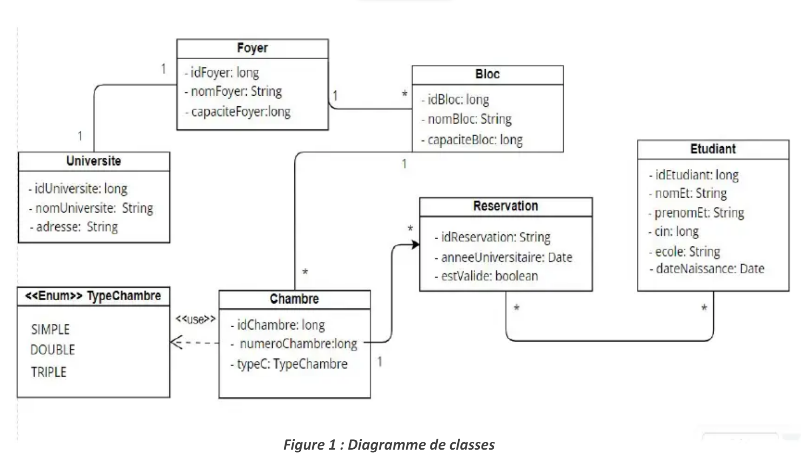
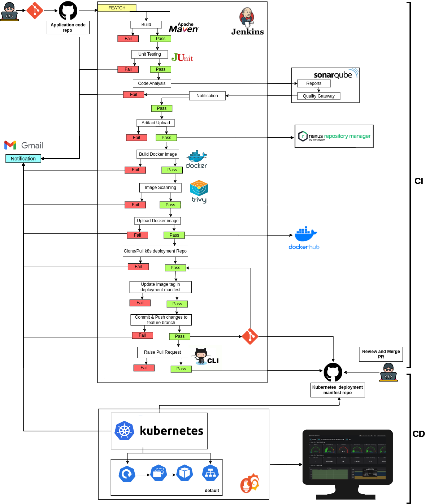
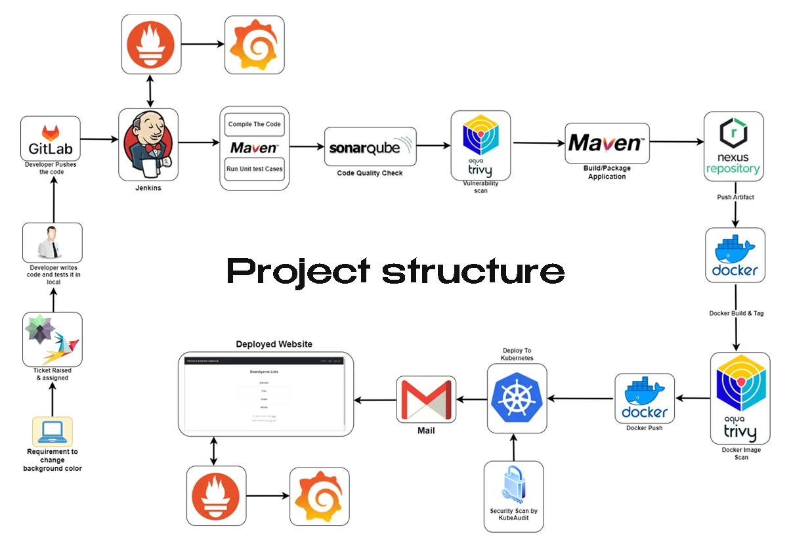

# 🚀 Plan 🚀

## 🛠️ Class Diagram : 

## 🛠️ Pipeline Structure

<!--  
 -->

## 🛠️ Phase 1: Setup Infra
- Created a robust network environment to ensure seamless communication.
- Established a Kubernetes cluster for container orchestration.
- Implemented Jenkins for automation of the CI/CD process.
- Integrated SonarQube for code quality analysis.
- Set up Nexus as our artifact repository.
- Implemented comprehensive monitoring solutions for real-time insights.

## 📁 Phase 2: Setup Private Git Repo
- Established a secure private Git repository.
- Implemented token-based authentication for enhanced security.
- Successfully pushed the source code into the repository, ensuring version control.

## 🔧 Phase 3: Configure Jenkins & CICD Pipeline
Configured Jenkins with necessary plugins for smooth pipeline execution.  
Designed a robust CI/CD pipeline with the following stages:
- Tools definition
- Compilation
- Testing
- File system scan / Dependency check scan
- SonarQube analysis
- Quality gate check
- Building/packaging application
- Publishing application artifacts to Nexus
- Building & tagging Docker images
- Vulnerability scanning of Docker images using Trivy
- Pushing Docker images to Docker Hub repository
- Deployment of application to Kubernetes
- Verification of deployment
- Email notification upon completion

## 🔍 Phase 4: Monitoring
- Implemented comprehensive monitoring solutions including:
  - System-level monitoring (CPU, RAM) using node_exporter
  - Website monitoring using blackbox_exporter
  - Leveraged Prometheus & Grafana for effective visualization and analysis.

## Explaination

# Introduction to CI/CD Pipeline
Introduction to the complete corporate CI/CD pipeline, covering infrastructure setup, server configuration, Kubernetes cluster creation, private repository setup, source code push, pipeline creation, and application monitoring.

## Client's Request and Developer's Task
Explanation of the client's request, Jira ticket creation, developer's task of writing source code, testing, pushing changes to GitHub, and the DevOps engineer's role in creating the pipeline using Jenkins.

## Pipeline Compilation and Unit Testing
Details on pipeline stages including compilation, unit testing, SonarQube code quality check, vulnerability scan, dependency check, and report generation.

## Application Building and Packaging
Building the application, creating an application artifact, publishing to Nexus repository, Docker image creation, tagging of Docker image, vulnerability scan using the Trivy tool, and pushing to Docker Hub repository.

## Application Deployment and Monitoring
Deployment to Kubernetes cluster, security scanning using kubeaudit, verification of deployment, mail notification setup, website monitoring using blackbox exporter, and system monitoring using node exporter.

## Phase Overview
Overview of the different phases of the CI/CD pipeline including network environment setup, Kubernetes cluster creation, virtual machine setup, tools configuration, Git repository creation, CI/CD pipeline setup, and monitoring setup.

## Continuous Integration and Quality Gates
The speaker covers continuous integration processes, sets up quality gates, and explains how to ensure code quality. They integrate continuous integration workflows, configure quality gates, and emphasize maintaining code quality standards in Jenkins pipelines.

## Deployment Pipeline and Pipeline Jobs
The speaker explains deployment pipelines, configures pipeline jobs, and demonstrates the management of pipelines. They discuss deployment pipeline setups, configure pipeline jobs, and manage pipelines effectively in Jenkins environments.

## Code Testing and Quality Assurance
The speaker discusses code testing procedures, emphasizes quality assurance practices, and guides on effective QA in Jenkins. They explain code testing methodologies, prioritize quality assurance practices, and provide insights into ensuring quality in code development.

## Artifact Deployment and Nexus Integration
The speaker deploys artifacts, integrates Nexus repositories, and explains the artifact deployment process. They deploy artifacts to Nexus repositories, configure repository integrations, and guide on deploying artifacts effectively in Nexus environments.

## Docker Image Building and Pipeline Execution
The speaker builds Docker images, executes pipelines, and explains the process of pipeline execution. They demonstrate Docker image building, execute pipelines, and provide insights into the execution of pipelines in Jenkins.

## DevOps Automation and Process Enhancements
The speaker focuses on DevOps automation, enhances development processes, and guides on process improvements. They emphasize DevOps automation practices, enhance development workflows, and provide guidance on improving processes for efficient software development.

## Security Practices and Pipeline Management
The speaker discusses security practices in Jenkins, manages pipelines efficiently, and explains the importance of secure pipeline management. They explain security practices for Jenkins environments, provide insights into managing pipelines effectively, and emphasize secure pipeline management practices.

## Setting Up Docker Image
The process of setting up a Docker image, building, tagging, and scanning it using Trivy before pushing it to Docker Hub repository is explained.

## Pushing Docker Image to DockerHub
After scanning the Docker image, the next step involves pushing the Docker image to the Docker Hub repository.

## Deploying to Kubernetes Cluster
Discussing the deployment of the application to a Kubernetes cluster using service accounts and Role-Based Access Control (RBAC) for security purposes.

## Role-Based Access Control in Kubernetes
Explaining the concept of Role-Based Access Control (RBAC) in Kubernetes by creating roles and assigning specific permissions to users based on their roles.

## Creating Service Account and Role for Deployment
Demonstrating the creation of a service account and role in Kubernetes for performing the deployment process securely.

## Configuring Mail Notifications
Detailing the configuration of email notifications in a CI/CD pipeline using Gmail SMTP server, application password, and Jenkins credentials.

## Monitoring with Prometheus and Grafana
Setting up monitoring using Prometheus, Grafana, and Blackbox Exporter to monitor websites, applications, and system metrics on Jenkins and the deployed application.

## Setting up Jenkins IP Address for Monitoring
Configuration of Jenkins IP address for monitoring in Prometheus and Grafana, including setting up the IP address and port for Jenkins, restarting Prometheus, and verifying the status of exporters.

## Restarting Prometheus
Instructions for restarting Prometheus by killing the running instance and starting it again to ensure proper functionality for monitoring.

## Verifying Exporters Status
Checking the status of exporters including Black Box and Node Exporter to ensure they are running properly for monitoring purposes.

## Creating Grafana Dashboards
Creating Grafana dashboards for system monitoring, including setting up a dashboard for system-level monitoring and another for monitoring Jenkins metrics.

## Monitoring Jenkins Metrics
Exploring the metrics available for monitoring Jenkins in Grafana, including system load, network traffic, memory info, and VM stats.

## Summary of Dashboard Creation
Overview of the two dashboards created, one for system-level metrics with Node Exporter and another for monitoring Jenkins with Black Box Exporter in Prometheus and Grafana.

